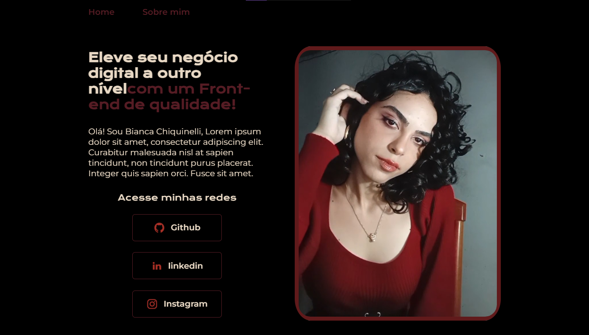

# Projeto de Prática Front-end
Bem vindo ao meu projeto de portfólio.

Este projeto foi desenvolvido com o objetivo de praticar e relembrar conceitos e funcionalidades do **HTML, CSS, Figma, Flexbox, responsividade** e o uso do **GitHub**. Não possui uma finalidade específica além do aprendizado e da experimentação com essas ferramentas.

## 💡 Objetivo

Explorar na prática:

* Estruturação de páginas com **HTML**;
* Estilos e personalização com **CSS**;
* Prototipação e design no **Figma**;
* Layouts flexíveis com **Flexbox**;
* Boas práticas de **responsividade**;
* Fluxo de trabalho com o **GitHub**, incluindo criação de repositórios, commits e versionamento de código.

## 🛠️ Funcionalidades

Este projeto não possui funcionalidades complexas ou interativas, mas foca em:

* Estruturar corretamente o **HTML** semânticamente;
* Aplicar estilos variados com **CSS**;
* Utilizar **Flexbox** para organizar os elementos na tela;
* Testar a **responsividade** em diferentes tamanhos de tela.

